# RaceIQ - System Architecture

## Executive Summary

RaceIQ is a comprehensive motorsport analytics platform that transforms raw telemetry data into actionable coaching insights through three integrated analytical approaches:

1. **Real-Time Analytics** - Lap-by-lap coaching during race simulation
2. **Comparative Analysis** - Beat-the-driver-ahead explanations
3. **Counterfactual Analysis** - What-if scenario modeling

This document details the complete system architecture, data flows, and technical implementation.

---

## System Overview


---

## Data Architecture

### Data Formats Handled

RaceIQ supports three distinct telemetry formats across the GR Cup dataset:


### Data Quality Pipeline


**Handled Edge Cases:**
- Lap 32768 corruption (Sebring)
- Missing GPS data (VIR, Barber, Mid-Ohio)
- Inconsistent signal naming (pbrake_f vs brake_pressure)
- JSON vs CSV format variations
- Partial lap data

---

## Feature Engineering Architecture

### Tier 1: Driver Profiling Features

**Purpose:** Stable characteristics that define a driver's skill level


**Validation:** Ratio > 1.5 (cross-driver std / within-driver std)

### Tier 2: State Monitoring Features

**Purpose:** Detect real-time changes during race


### Race-Level Features


---

## Analytics Engines

### 1. Real-Time Coaching System


**Alert Types:**
- 🔴 Critical: Degradation >0.1s/lap vs field
- 🟡 Warning: Technique drift >2σ from baseline
- 🟢 Advisory: Traffic detected, pace maintained

### 2. Comparative Analysis (Beat-the-Driver-Ahead)

```mermaid
flowchart TD
    START[Race Results] --> SORT[Sort by finish position]
    SORT --> ITERATE[For each driver]

    ITERATE --> AHEAD{Who finished<br/>directly ahead?}

    AHEAD -->|P1| P2[Compare to P2<br/>Why we won]
    AHEAD -->|Other| PN[Compare to P(N-1)<br/>Why we lost]

    P2 --> ANALYZE[Analyze differences]
    PN --> ANALYZE

    ANALYZE --> PACE[Pace delta<br/>by stint]
    ANALYZE --> DEG[Degradation<br/>delta]
    ANALYZE --> TRAFFIC[Traffic<br/>delta]

    PACE --> ROOT[Identify root cause]
    DEG --> ROOT
    TRAFFIC --> ROOT

    ROOT --> QUANT[Quantify gap<br/>in seconds]
    QUANT --> GPT[GPT-4o narrative]
```

**Key Innovation:** Instead of comparing to field average, each driver is compared to the specific person who beat them, making insights immediately actionable.

### 3. Counterfactual Analysis


**Model:** Gradient Boosting Regressor trained on race features → final position

---

## Predictive Modeling

### Model Pipeline

```mermaid
graph LR
    subgraph "Training Data"
        HIST[Historical races<br/>13 races] --> SPLIT[Train/Test Split<br/>Leave-one-out]
    end

    subgraph "Features"
        SPLIT --> F1[Pace metrics<br/>early/mid/late]
        SPLIT --> F2[Degradation rate]
        SPLIT --> F3[Consistency]
        SPLIT --> F4[Traffic impact]
        SPLIT --> F5[Driver baseline]
    end

    subgraph "Models"
        F1 --> LAP[Lap Time<br/>Linear Regression]
        F1 --> POS[Position<br/>Gradient Boosting]

        F2 --> LAP
        F2 --> POS

        F3 --> LAP
        F3 --> POS

        F4 --> POS
        F5 --> POS
    end

    subgraph "Validation"
        LAP --> VAL[Cross-validation<br/>14 races]
        POS --> VAL
        VAL --> METRICS[MAE, R², Position accuracy]
    end
```



### Model Selection Rationale

| Model Type | Use Case | Rationale |
|------------|----------|-----------|
| Linear Regression | Lap time prediction | Linear relationship between features and lap time; interpretable coefficients |
| Gradient Boosting | Position prediction | Handles non-linear effects (e.g., tire strategy, traffic); robust to outliers |
| Statistical Analysis | Degradation rate | Simple linear fit captures tire wear trend |

---

## Dashboard Architecture

### Page Structure

```mermaid
graph TB
    subgraph "Multi-Page Dashboard"
        HOME[Dashboard.py<br/>Landing page]

        HOME --> PAGE1[Race Analytics<br/>Real-time coaching]
        HOME --> PAGE2[Race Insights<br/>Post-race analysis]
        HOME --> PAGE3[Model Validation<br/>Performance metrics]
    end

    subgraph "Race Analytics Components"
        PAGE1 --> NOW[NOW: Current state<br/>Position, gaps, lap time]
        PAGE1 --> NEXT[NEXT: Predictions<br/>Next lap forecast]
        PAGE1 --> CONTEXT[CONTEXT: Race dynamics<br/>Sector times, field position]
        PAGE1 --> DIAG[DIAGNOSTICS: Issues<br/>Conditional alerts]
        PAGE1 --> RADIO[RADIO: Coaching<br/>Actionable message]
    end

    subgraph "Race Insights Components"
        PAGE2 --> COMP[Comparative Tab<br/>Beat-the-ahead analysis]
        PAGE2 --> COUNT[Counterfactual Tab<br/>What-if scenarios]
        PAGE2 --> NARR[AI Narratives<br/>GPT-4o summaries]
    end

    subgraph "Model Validation"
        PAGE3 --> ACC[Accuracy Metrics<br/>MAE, R², Position error]
        PAGE3 --> VIS[Visualizations<br/>Predicted vs Actual]
        PAGE3 --> DRIVER[Per-Driver Breakdown<br/>Model performance]
    end
```



### State Management


---

## Performance Optimizations

### Data Loading Strategy

**Challenge:** Loading full telemetry for 25 drivers × 20 laps takes ~120 seconds

**Solution:** Lazy loading with precomputed analytics


### Precomputation Strategy

**Files precomputed for all 14 races:**

1. `{track}_{race}_comparative.parquet` - Beat-the-ahead analysis with GPT-4o narratives
2. `{track}_{race}_counterfactual.parquet` - What-if scenarios with position predictions

**Benefits:**
- Race Insights tab loads instantly
- No API calls during user session
- Consistent narratives across page refreshes

---

## AI Integration

### Narrative Generation Pipeline


### Prompt Engineering

**System Prompt Principles:**
1. **Data-driven**: Base insights strictly on provided metrics
2. **Specific**: Provide concrete numbers, not vague statements
3. **Professional**: Use motorsport terminology
4. **Concise**: 2-3 sentences maximum
5. **Actionable**: Focus on technical factors (tire management, setup)

**Avoid:**
- "Push harder" or "try harder" advice
- Emotional language or excessive praise
- Speculation about factors not in data

---

## Technology Stack

### Core Libraries

| Component | Technology | Purpose |
|-----------|-----------|---------|
| Data Processing | pandas, numpy | Telemetry manipulation, feature engineering |
| Visualization | Plotly, Matplotlib | Interactive charts, track maps |
| ML Models | scikit-learn | Regression, gradient boosting |
| Dashboard | Streamlit | Multi-page web interface |
| AI Narratives | OpenAI GPT-4o | Natural language summaries |
| Geospatial | Shapely | GPS racing line analysis |

### Deployment Architecture


---

## Scalability Considerations

### Current Limitations

1. **Memory:** Full telemetry for one race: ~47MB in memory
2. **Compute:** Profile building: ~5 seconds for 25 drivers
3. **Storage:** Parquet files: ~2MB per race (compressed)

### Future Optimizations


---

## Testing & Validation

### Data Validation


### Model Validation

**Cross-validation approach:** Leave-one-race-out

- Train on 13 races
- Validate on 1 held-out race
- Repeat for all 14 races
- Report aggregate metrics

**Metrics tracked:**
- Position prediction: Mean Absolute Error
- Lap time prediction: R² score
- Top-5 accuracy: Binary classification

---

## Security & Privacy

### Data Handling

- **No PII:** Only vehicle numbers (anonymous)
- **API Keys:** Environment variables, never committed
- **Local Storage:** Data stays on user's machine in development

### Future Considerations

- OAuth authentication for hosted version
- Rate limiting on GPT-4o API calls
- Data encryption at rest

---

## Summary

RaceIQ demonstrates a complete motorsport analytics stack:

1. **Robust Data Pipeline:** Handles 3 telemetry formats, 14 races, multiple tracks
2. **Sophisticated Analytics:** Real-time, comparative, and counterfactual approaches
3. **Production-Ready UI:** Lazy loading, precomputation, responsive design
4. **AI Integration:** GPT-4o generates professional coaching narratives
5. **Validated Models:** Cross-validated predictions across all races

**Key Technical Achievements:**
- Multi-format telemetry loader with automatic detection
- Two-tier feature architecture (profile vs. state)
- Beat-the-driver-ahead comparative framework
- Precomputed analytics for instant page loads
- Integrated AI narrative generation

**Next Steps:**
- Deploy to Streamlit Cloud
- Add real-time data ingestion
- Expand to more race series
- Mobile-responsive design
